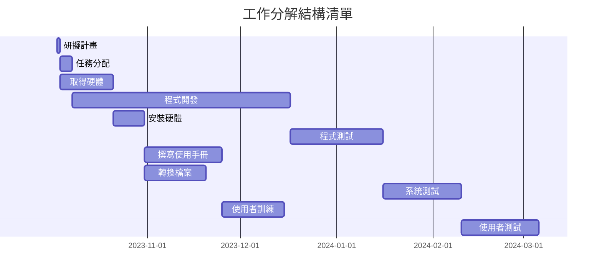
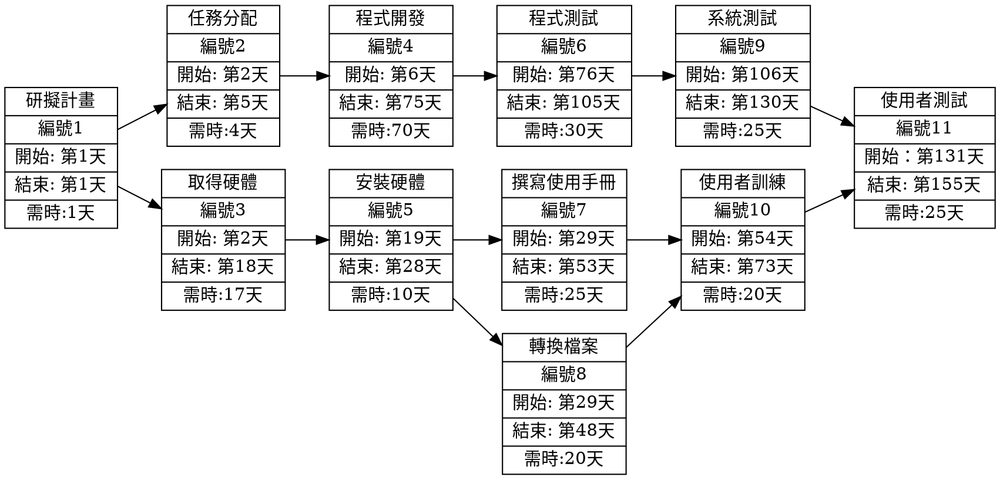

# 專案管理

###工作分解結構清單
| 任務 | 說明 | 需時 | 前置任務 |
| :-: | :- | :-: | :-: |
| 1 | 研擬計畫 | 1 | - |
| 2 | 任務分配 | 4 | 1 |
| 3 | 取得硬體 | 17 | 1 |
| 4 | 程式開發 | 70 | 2 |
| 5 | 安裝硬體 | 10 | 3 |
| 6 | 程式測試 | 30 | 4 |
| 7 | 撰寫使用手冊 | 25 | 5 |
| 8 | 轉換檔案 | 20 | 5 |
| 9 | 系統測試 | 25 | 6 |
| 10 | 使用者訓練 | 20 | 7,8 |
| 11 | 使用者測試 | 25 | 9,10 |
---
## 甘特圖
## Mermaid


---

## PERT/CPM圖

![graphviz](https://edotor.net/?engine=dot#digraph%20%7B%0A%09node%5Bshape%3Drecord%5D%3B%0A%09rankdir%3D%22LR%22%3B%0A%20%20%20%20no1%20%5Blabel%20%3D%20%22%E7%A0%94%E6%93%AC%E8%A8%88%E7%95%AB%20%7C%20%E7%B7%A8%E8%99%9F%201%20%7C%20%E9%96%8B%E5%A7%8B%3A%20%E7%AC%AC1%E5%A4%A9%20%7C%20%E7%B5%90%E6%9D%9F%3A%20%E7%AC%AC1%E5%A4%A9%20%7C%20%E9%9C%80%E6%99%82%3A1%E5%A4%A9%22%5D%0A%20%20%20%20no2%20%5Blabel%20%3D%20%22%E4%BB%BB%E5%8B%99%E5%88%86%E9%85%8D%20%7C%20%E7%B7%A8%E8%99%9F%202%20%7C%20%E9%96%8B%E5%A7%8B%3A%20%E7%AC%AC2%E5%A4%A9%20%7C%20%E7%B5%90%E6%9D%9F%3A%20%E7%AC%AC5%E5%A4%A9%20%7C%20%E9%9C%80%E6%99%82%3A4%E5%A4%A9%22%5D%0A%20%20%20%20no1%20-%3E%20no2%0A%20%20%20%20no3%20%5Blabel%20%3D%20%22%E5%8F%96%E5%BE%97%E7%A1%AC%E9%AB%94%20%7C%20%E7%B7%A8%E8%99%9F%203%20%7C%20%E9%96%8B%E5%A7%8B%3A%20%E7%AC%AC2%E5%A4%A9%20%7C%20%E7%B5%90%E6%9D%9F%3A%20%E7%AC%AC18%E5%A4%A9%20%7C%20%E9%9C%80%E6%99%82%3A17%E5%A4%A9%22%5D%0A%20%20%20%20no1%20-%3E%20no3%0A%20%20%20%20no4%20%5Blabel%20%3D%20%22%E7%A8%8B%E5%BC%8F%E9%96%8B%E7%99%BC%20%7C%20%E7%B7%A8%E8%99%9F%204%20%7C%20%E9%96%8B%E5%A7%8B%3A%20%E7%AC%AC6%E5%A4%A9%20%7C%20%E7%B5%90%E6%9D%9F%3A%20%E7%AC%AC75%E5%A4%A9%20%7C%20%E9%9C%80%E6%99%82%3A70%E5%A4%A9%22%5D%0A%20%20%20%20no2%20-%3E%20no4%0A%20%20%20%20no5%20%5Blabel%20%3D%20%22%E5%AE%89%E8%A3%9D%E7%A1%AC%E9%AB%94%20%7C%20%E7%B7%A8%E8%99%9F%205%20%7C%20%E9%96%8B%E5%A7%8B%3A%20%E7%AC%AC19%E5%A4%A9%20%7C%20%E7%B5%90%E6%9D%9F%3A%20%E7%AC%AC28%E5%A4%A9%20%7C%20%E9%9C%80%E6%99%82%3A10%E5%A4%A9%22%5D%0A%20%20%20%20no3%20-%3E%20no5%0A%20%20%20%20no6%20%5Blabel%20%3D%20%22%E7%A8%8B%E5%BC%8F%E6%B8%AC%E8%A9%A6%20%7C%20%E7%B7%A8%E8%99%9F%206%20%7C%20%E9%96%8B%E5%A7%8B%3A%20%E7%AC%AC76%E5%A4%A9%20%7C%20%E7%B5%90%E6%9D%9F%3A%20%E7%AC%AC105%E5%A4%A9%20%7C%20%E9%9C%80%E6%99%82%3A30%E5%A4%A9%22%5D%0A%20%20%20%20no4%20-%3E%20no6%0A%20%20%20%20no7%20%5Blabel%20%3D%20%22%E6%92%B0%E5%AF%AB%E4%BD%BF%E7%94%A8%E6%89%8B%E5%86%8A%20%7C%20%E7%B7%A8%E8%99%9F%207%20%7C%20%E9%96%8B%E5%A7%8B%3A%20%E7%AC%AC29%E5%A4%A9%20%7C%20%E7%B5%90%E6%9D%9F%3A%20%E7%AC%AC53%E5%A4%A9%20%7C%20%E9%9C%80%E6%99%82%3A25%E5%A4%A9%22%5D%0A%20%20%20%20no5%20-%3E%20no7%0A%20%20%20%20no8%20%5Blabel%20%3D%20%22%E8%BD%89%E6%8F%9B%E6%AA%94%E6%A1%88%20%7C%20%E7%B7%A8%E8%99%9F%208%20%7C%20%E9%96%8B%E5%A7%8B%3A%20%E7%AC%AC29%E5%A4%A9%20%7C%20%E7%B5%90%E6%9D%9F%3A%20%E7%AC%AC48%E5%A4%A9%20%7C%20%E9%9C%80%E6%99%82%3A20%E5%A4%A9%22%5D%0A%20%20%20%20no5%20-%3E%20no8%0A%20%20%20%20no9%20%5Blabel%20%3D%20%22%E7%B3%BB%E7%B5%B1%E6%B8%AC%E8%A9%A6%20%7C%20%E7%B7%A8%E8%99%9F%209%20%7C%20%E9%96%8B%E5%A7%8B%3A%20%E7%AC%AC106%E5%A4%A9%20%7C%20%E7%B5%90%E6%9D%9F%3A%20%E7%AC%AC130%E5%A4%A9%20%7C%20%E9%9C%80%E6%99%82%3A25%E5%A4%A9%22%5D%0A%20%20%20%20no6%20-%3E%20no9%0A%20%20%20%20no10%20%5Blabel%20%3D%20%22%E4%BD%BF%E7%94%A8%E8%80%85%E8%A8%93%E7%B7%B4%20%7C%20%E7%B7%A8%E8%99%9F%2010%20%7C%20%E9%96%8B%E5%A7%8B%3A%20%E7%AC%AC54%E5%A4%A9%20%7C%20%E7%B5%90%E6%9D%9F%3A%20%E7%AC%AC73%E5%A4%A9%20%7C%20%E9%9C%80%E6%99%82%3A20%E5%A4%A9%22%5D%0A%20%20%20%20no7%20-%3E%20no10%0A%20%20%20%20no8%20-%3E%20no10%0A%20%20%20%20no11%20%5Blabel%20%3D%20%22%E4%BD%BF%E7%94%A8%E8%80%85%E6%B8%AC%E8%A9%A6%20%7C%20%E7%B7%A8%E8%99%9F%2011%20%7C%20%E9%96%8B%E5%A7%8B%EF%BC%9A%20%E7%AC%AC131%E5%A4%A9%20%7C%20%E7%B5%90%E6%9D%9F%3A%20%E7%AC%AC155%E5%A4%A9%20%7C%20%E9%9C%80%E6%99%82%3A25%E5%A4%A9%22%5D%0A%20%20%20%20no9%20-%3E%20no11%0A%20%20%20%20no10%20-%3E%20no11%0A%7D)


---

## 關鍵路徑
```
1 -> 2 -> 4-> 6 -> 9 -> 11