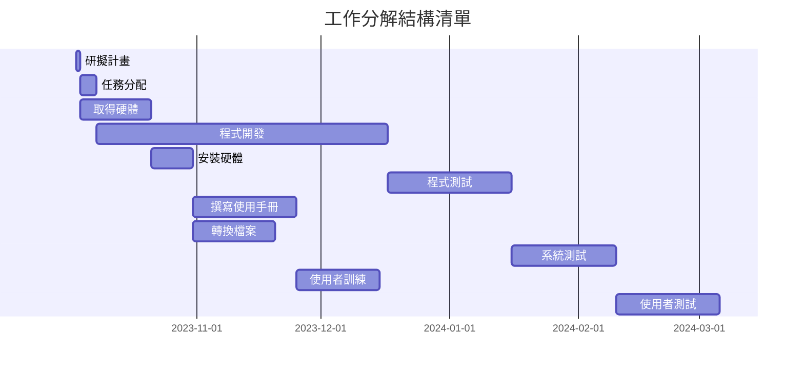
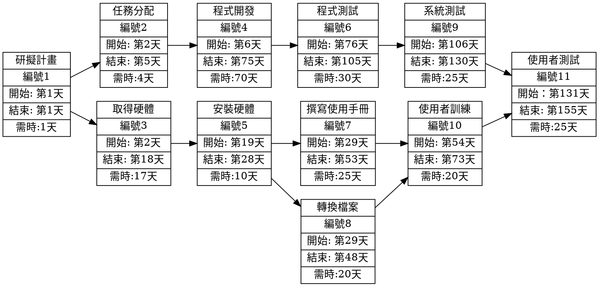

# 專案管理

###工作分解結構清單
| 任務 | 說明 | 需時 | 前置任務 |
| :-: | :- | :-: | :-: |
| 1 | 研擬計畫 | 1 | - |
| 2 | 任務分配 | 4 | 1 |
| 3 | 取得硬體 | 17 | 1 |
| 4 | 程式開發 | 70 | 2 |
| 5 | 安裝硬體 | 10 | 3 |
| 6 | 程式測試 | 30 | 4 |
| 7 | 撰寫使用手冊 | 25 | 5 |
| 8 | 轉換檔案 | 20 | 5 |
| 9 | 系統測試 | 25 | 6 |
| 10 | 使用者訓練 | 20 | 7,8 |
| 11 | 使用者測試 | 25 | 9,10 |
---
## 甘特圖
## Mermaid


---

## PERT/CPM圖



---

## 關鍵路徑
```
1 -> 2 -> 4-> 6 -> 9 -> 11